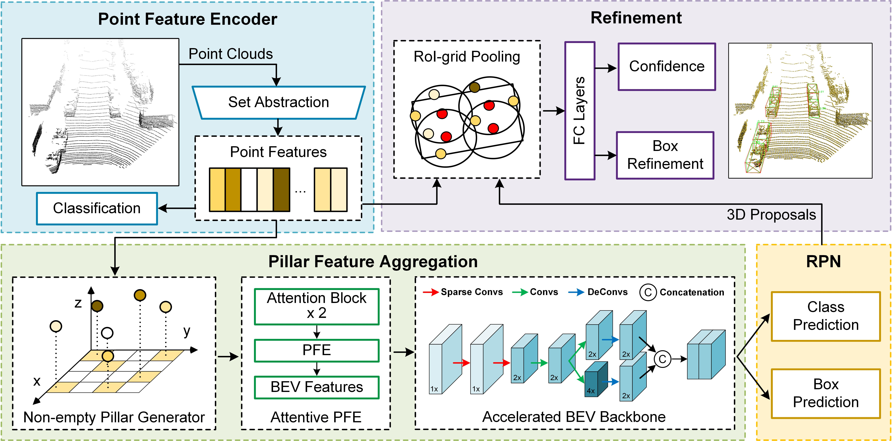

# HybridPillars: Hybrid Point-Pillar Network for Real-time Two-stage 3D Object Detection


Abstract: LiDAR-based 3D object detection is an important perceptual task in various fields such as intelligent transportation, autonomous driving and robotics. Existing two-stage point-voxel methods contribute to the boost of accuracy on 3D object detection by utilizing precise point-wise features to refine 3D proposals. Although obtaining promising results, these methods are not suitable for real-time applications. Firstly, the inference speed of existing point-voxel hybrid frameworks is slow because the acquisition of point features from voxel features consumes a lot of time. Secondly, existing point-voxel methods rely on 3D convolution for voxel feature learning, which increases the difficulty of deployment on embedded computing platforms. To address these issues, we propose a real-time two-stage detection network, named HybridPillars.
We first propose a novel hybrid framework by integrating a point feature encoder into a point-pillar pipeline efficiently. By combining point-based and pillar-based networks, our method can discard 3D convolution to reduce computational complexity. Furthermore, we propose a novel pillar feature aggregation network to efficiently extract BEV features from point-wise features, thereby significantly enhancing the performance of our network. Extensive experiments demonstrate that our proposed HybridPillars not only boosts the inference speed, but also achieves competitive detection performance compared with other methods. 

 

## 1. Recommended Environment
We have tested this project with the following environments:
- Ubuntu 18.04
- Python 3.7.13
- PyTorch 1.7.0, cuda 11.0 version
- CUDA NVCC 11.1
- Spconv 2.1.21

## 2. Installation
``` bash
pip install -r requirement.txt
bash compile.sh
```
## 3. Prepare Data
- Prepare KITTI dataset and road planes
```bash
# Download KITTI and organize it into the following form:
├── data
│   ├── kitti
│   │   │── ImageSets
│   │   │── training
│   │   │   ├──calib & velodyne & label_2 & image_2 & (optional: planes)
│   │   │── testing
│   │   │   ├──calib & velodyne & image_2

# Generatedata infos:
python -m pcdet.datasets.kitti.kitti_dataset create_kitti_infos tools/cfgs/dataset_configs/kitti_dataset.yaml
```

## 4. Train
```
cd tools
# a. train the two-stage model
python ./train.py --cfg_file ./cfg/kitti_models/hybridpillars.yaml

or

# b. train the single-stage model
python ./train.py --cfg_file ./cfg/kitti_models/hybridpillars-ssd.yaml
```
Support single or multiple GPUs training.
## 5. Test
```
python test.py --cfg-file ${CONFIG_FILE} --ckpt ${CKPT}
```
## 6. FLOPs Calculation Method
- Please following [link 1](https://github.com/open-mmlab/OpenPCDet/issues/1403) and [link 2](https://github.com/CVMI-Lab/SparseKD/blob/master/docs/GETTING_STARTED.md) to install thop with SPCONV extension
- We provide an API for FLOPs Calculation
``` python
from pcdet.utils.spconv_utils import spconv
from thop import profile, clever_format, profile_acts

def cal_flops(model, batch_dict):
    macs, params, acts = profile_acts(model, inputs=(batch_dict,),
                           custom_ops={
                            spconv.SubMConv3d: spconv.SubMConv3d.count_your_model,
                            spconv.SparseConv3d: spconv.SparseConv3d.count_your_model,
                            spconv.SubMConv2d: spconv.SubMConv2d.count_your_model,
                            spconv.SparseConv2d: spconv.SparseConv2d.count_your_model}
                           )
    return macs, params, acts

...

macs, params, acts = cal_flops(model, data_dict)
```

## 7. Acknowledgement
- Thanks for the [OpenPCDet](https://github.com/open-mmlab/OpenPCDet), this implementation is mainly based on the pcdet v0.6.0.
- Parts of our code refer to the excellent work [IA-SSD](https://github.com/yifanzhang713/IA-SSD).

## License

This project is released under the [Apache 2.0 license](LICENSE).

## Citation
Coming soon.